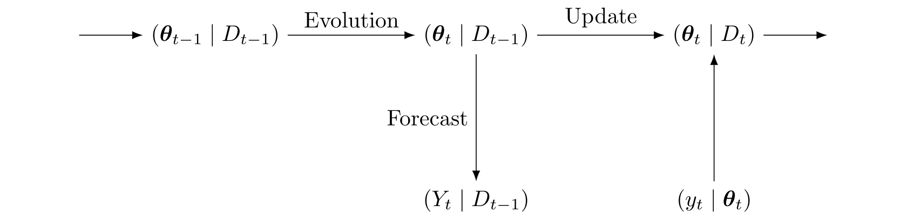

---
class: center, middle, inverse

# Bayesian Dynamic Linear Model

---
# Definition

Let $D_{t-1}$ be the information set until time $t-1$, then the DLM is
defined by 

$$
\begin{eqnarray}
\left(Y_t \mid D_{t-1}, V_t\right) &\sim& \mathrm{N}\left[\mathbf{F}_t^\top\,\boldsymbol{\theta}_t, V_t \right] \\
\left(\boldsymbol{\theta}_t \mid D_{t-1}, V_t\right) &\sim& \mathrm{N}\left[\mathbf{G}_t\,\boldsymbol{\theta}_{t-1}, V_t\,\mathbf{W}_t\right] \\
\left(\phi_t \mid D_{t-1} \right) &\sim& \mathrm{Gamma}[\beta n_{t-1} / 2, (1- \beta)\,d_{t-1}/2]
\end{eqnarray}
$$
- $Y_t$ is a scalar observation at time $t$;
- $\mathbf{F}_t$ is a $p\times 1$ regression vector with known constants at time $t$;
- $\boldsymbol{\theta}_t$ is a $p\times 1$ state vector at time $t$;
- $\mathbf{G}_t$ is a $p\times p$ matrix with known constants describing the state evolution;
- $V_t$ is the observation variance, $\phi_t = 1 / V_t$ is the precision, and $\mathbf{W}_t$ is the evolution variance matrix.
<!-- - $n_{t-1}$ and $d_{t-1}$ are, respectively the degrees of freedom and sum of squares parameters of Gamma prior. -->

--

> The variance can change over time due to the discount factor, $\beta \in (0, 1]$,
and if it equals one, it results in the constant variance model, $V_t = V$.

---
# Initial information

- The model is completely specified through the initial information.

$$
\begin{eqnarray}
(\boldsymbol{\theta}_{t-1} \mid \phi_{t-1}, D_{t-1}) &\sim& \mathrm{N}[\mathbf{m}_{t-1},   \phi_{t-1}^{-1}\mathbf{C}_{t-1}] \\
(\phi_{t-1} \mid D_{t-1}) &\sim& \textrm{Gamma}[n_{t-1} / 2, d_{t-1} / 2]
\end{eqnarray}
$$
where $\mathbf{m}_{t-1}$, $\mathbf{C}_{t-1}$, $n_{t-1}$, and $d_{t-1}$ are
prior parameters that should be specified.

---
# Sequential inference

- The two main stages involved in the sequential inference are: (i) _evolution_ and (ii) _updating_,
which is essentially a direct application of Bayes' theorem.

- Unconditional to $V_t$ all the distributions involved follows $t$-Student
distribution.

- Further details can be found in `r Citet(myBib, "West1997")`.

---
# Specification of $\mathbf{W_t}$

- To maintain the sequential inference feature, $\mathbf{W}_t$ is specified using the **discount factor** technique.

- A single discount factor denoted by $\delta \in (0,1]$ is a multiplicative factor useful to **increase the uncertainty** in the evolution step of the sequential inference in DLMs.

--

- The prior variance is defined as $\mathbf{R}_t = \mathbf{C}_{t-1} + \mathbf{W}_{t}$ 

--
- For the static model $\mathbf{W}_t = 0$, so that $\mathbf{R}_t = \mathbf{C}_{t-1}$. 

--
- If the model is dynamic the precision $\mathbf{R}_t^{-1}$ is reduced relative to the posterior at time $t-1$, i.e., $\mathbf{C}_{t-1}^{-1}$. Then the intuitive way to express this relation is by

$$\mathbf{R}^{-1}_t = \delta \mathbf{C}_{t-1}^{-1} \rightarrow \mathbf{R}_t = \delta^{-1} \mathbf{C}_{t-1}$$
where $\delta \in (0, 1]$ is a discount factor. 

---
# Specification of $\mathbf{W_t}$

- The system variance $\mathbf{W}_t$ can be specified as

$$\mathbf{W}_t = \dfrac{1-\delta}{\delta}\,\mathbf{C}_{t-1}.$$

--

- $\delta$ lies in $(0, 1]$ and its typical range for practical analysis is $[0.9, 0.99]$.

- If $\delta \approx 0$ the elements of $\mathbf{W}_{t}$ will be very large, resulting in an unstable model component.

--

> Model adaptation is carried out by raising the uncertainty of the state parameters when a model breakdown is observed.

