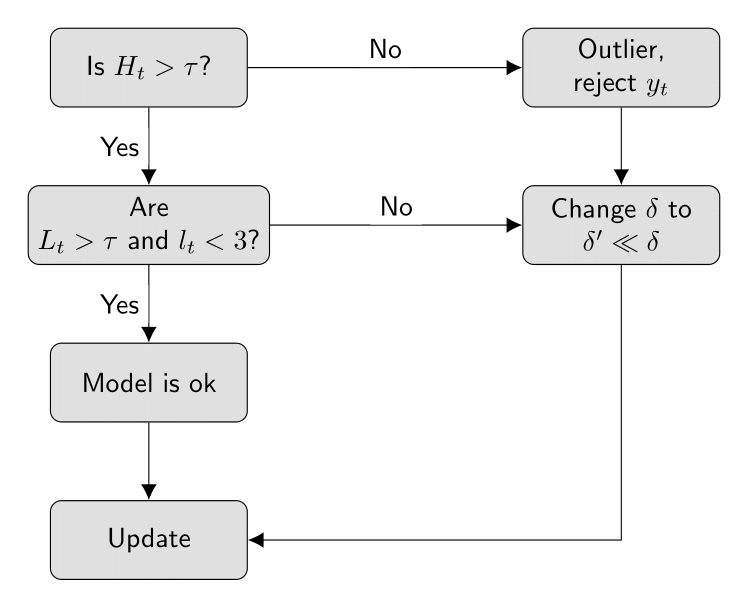

---
class: center, middle, inverse

# Automatic Sequential Monitoring

---
# In nutshell

It involves the following main steps: 

1. Propose an alternative DLM $(M_1)$ describing a level and/or scale shift; 

2. Compute the Bayes factor, $H_t$ and update the cumulative Bayes factor $L_t$ and run-lenght $l_t$;

3. Check if measures indicates potential model breakdown deviates;

4. If so, performs automatic interventions in order to model adapts itself.

> The method assess the model performance based on purely statistical measures.

---
# In nutshell

```{r monitor-fig, fig.align="center", out.width="60%"}

```

---
# Bayes factor

At time $t$, the Bayes factor based on the most recent $k$ observations is given by

$$B_t(k) = H_t\,B_{t-1}(k-1) = \dfrac{p(y_t,\ldots, y_{t-k+1} \mid D_{t-k})}{p_A(y_t,\ldots, y_{t-k+1} \mid D_{t-k})}$$

where

$$H_t = \dfrac{p(y_t \mid D_{t-1})}{p_A(y_t \mid D_{t-1})}$$
and 
- $p_A(y_t \mid D_t)$ is the predictive density distribution of the alternative model $M_A$


--
> Given a suitable alternative model, small values of these Bayes factors
indicate poor predictive ability, or failure, of the standard model.


