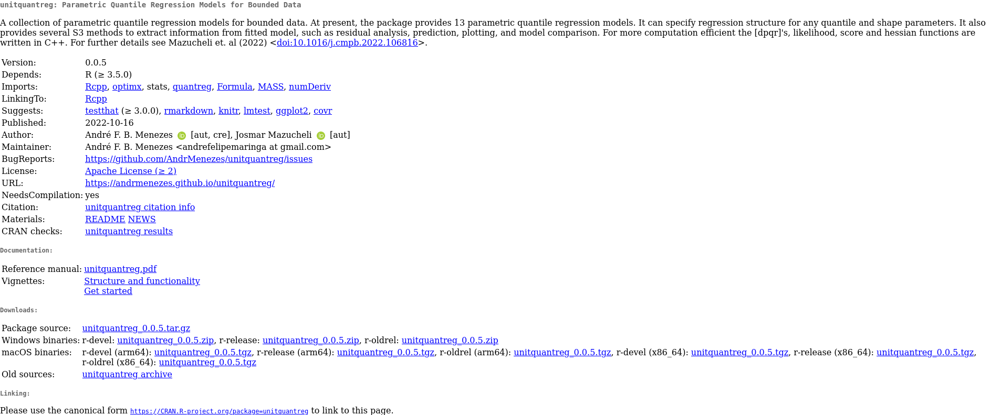

---
class: center, middle, inverse
# The `unitquantreg` R package

---
# Overview

```{r package-sheet, out.width="100%"}

```

<!-- - A collection of parametric quantile regression models for bounded data. -->

<!-- - At present, the package provides 13 families of distributions. -->

<!-- - It can specify regression structure for any quantile and shape parameters. -->

<!-- - It also provides several S3 methods to extract information from fitted model. -->

<!-- - The [dpqr]'s, likelihood, score and hessian functions are written in `C++`. -->

<!-- - Inference is performed under the frequentist paradigm, and the `optimx` -->
<!-- package is used to perform the numerical optimization. -->

---
# Water supply data

- Modeling the quantiles of the response distribution, `phpws`, is essential to comprehend the impact of socio-demographic covariates on cities with different levels of water supply accessibility.

```{r data-descr-remember, fig.width=14, fig.height=6}
probs <- seq(0, 1, by = 0.001)
data_quants <- water |> 
  dplyr::group_by(fct_region) |> 
  dplyr::summarise(quants = quantile(phpws, probs = probs),
                   .groups = "drop") |>
  dplyr::mutate(probs = rep(probs, times = 2))

p_quant <- ggplot(data = data_quants, aes(x = probs, y = quants,
                                          col = fct_region)) +
  geom_line() +
  geom_point(data = dplyr::filter(data_quants, probs == 0.10),
             aes(x = probs, y = quants, col = fct_region), size = 3) +
  labs(x = expression(tau), y = expression(Q(tau)), col = "")
p_quant
q_10_north <- data_quants |> 
  dplyr::filter(fct_region == "Northeast", probs == 0.10) |>
  dplyr::mutate(quants = 100 * quants) |> 
  dplyr::pull(quants) |> 
  formatC(digits = 2, width = 4, format = "f") |>
  paste0("\\%")
q_10_south <- data_quants |> 
  dplyr::filter(fct_region == "Southeast", probs == 0.10) |> 
  dplyr::mutate(quants = 100 * quants) |> 
  dplyr::pull(quants) |> 
  formatC(digits = 2, width = 4, format = "f") |> 
  paste0("\\%")
```

- $Q(10\% \mid \textrm{Northeast}) = `r q_10_north`$ and
$Q(10\% \mid \textrm{Southeast}) = `r q_10_south`$.

<!-- - $10\%$ of cities in Northeast (Southeast) have a proportion of households with piped water supply below $53.30\%(79.21\%)$. -->

---
# The workhouse function

- The workhorse function is `unitquantreg()`, which follows the same interface
as `stats::glm`.

```{r fit-uw, echo=TRUE}
library(unitquantreg)
(mod <- unitquantreg(formula = phpws ~ mhdi + std__incpc + region + log(pop),
                     data = water, tau = 0.5, family = "uweibull",
                     link = "logit", link.theta = "log"))
```

--

```{r methods}
methods(class = "unitquantreg")
```

---
# `summary`

```{r summary, echo=TRUE}
summary(mod)
```

---
# `plot`

<!-- - We can check model assumptions through diagnostic plots. -->

```{r plot, echo=TRUE, fig.width=10, fig.height=6}
par(mfrow = c(2, 2))
plot(mod)
```

---
# Fit for various quantiles

- The full advantage of quantile regression becomes clear when estimating a
whole family of quantile regressions.

```{r fits, echo=TRUE}
fits <- unitquantreg(formula = phpws ~ mhdi + std__incpc + region + log(pop),
                     data = water, tau = 1:49/50, family = "uweibull",
                     link = "logit", link.theta = "log")
class(fits)
methods(class = "unitquantregs")
sapply(fits[c("0.1", "0.5", "0.9")], coef)
```

- The impact of HDMI is greater in lower quantiles than upper quantiles of the response. $\widehat{\beta}_1(0.1) = 14.10 \rightarrow \widehat{\beta}_1(0.9) = 10.72$

<!-- (cities with **lower** household with piped water supply) -->

---
# Visualization (`plot`)

```{r plot-fits, echo=TRUE}
plot(fits, which = "coef", parm = 1:4)
```


